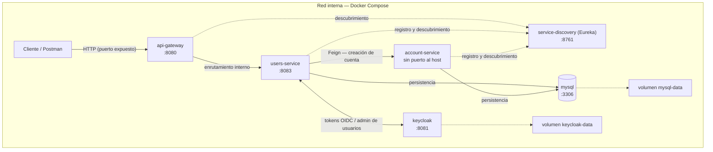

# Infraestructura — Sprint 1

## 1. Herramientas locales

- **Git**: control de versiones del proyecto.
- **Docker + Docker Compose**: el stack completo se define en `docker-compose.yml` y se levanta con un solo comando (`docker compose up -d --build`).
- **Funcionamiento en microservicios**: el sistema corre como 6 contenedores aislados que se comunican por una red interna; `api-gateway` es el único punto de entrada desde afuera.

## 2. Diseño de la infraestructura

| Servicio            | Imagen / build                                | Rol                                               | Puerto (host)                         | Dependencias                                              |
| ------------------- | --------------------------------------------- | ------------------------------------------------- | ------------------------------------- | --------------------------------------------------------- |
| `mysql`             | `mysql:8.4`                                   | Base de datos relacional                          | `3306`                                | —                                                         |
| `keycloak`          | `quay.io/keycloak/keycloak:26.7.3`            | Autenticación y administración de usuarios (OIDC) | `8081`                                | Import del realm desde `docker/keycloak`                  |
| `service-discovery` | build `services/service-discovery/Dockerfile` | Registro y descubrimiento de servicios (Eureka)   | `8761`                                | —                                                         |
| `api-gateway`       | build `services/api-gateway/Dockerfile`       | Puerta de entrada y enrutamiento                  | `8080`                                | `service-discovery`                                       |
| `users-service`     | build `services/users-service/Dockerfile`     | Registro, login y logout de usuarios              | `8083`                                | `mysql`, `keycloak`, `service-discovery`                  |
| `account-service`   | build `services/account-service/Dockerfile`   | Cuentas de la billetera (CVU, alias)              | Sin puerto al host (solo red interna) | `mysql`, `keycloak`, `service-discovery`, `users-service` |

**Volúmenes de persistencia:**

- `mysql-data`: datos de MySQL.
- `keycloak-data`: datos de Keycloak.

> `account-service` no publica puerto al host: solo lo invoca `users-service` por la red interna (Feign, con descubrimiento vía Eureka). Todo el tráfico externo entra por `api-gateway` (`8080`), que enruta únicamente a `users-service`.

## 3. Boceto de la red

El tráfico del cliente entra por `api-gateway`, que enruta hacia `users-service` por la red interna de Docker. Los servicios se registran en `service-discovery` (Eureka) para localizarse entre sí. `users-service` se comunica con `account-service` vía Feign (creación de cuenta en el registro), resuelve autenticación contra Keycloak, y ambos servicios de negocio persisten en MySQL.

## 4. Componentes

| Componente         | En este proyecto                                                                                                                                                                                   |
| ------------------ | -------------------------------------------------------------------------------------------------------------------------------------------------------------------------------------------------- |
| **Servidores**     | Los 6 contenedores del stack: `api-gateway`, `service-discovery`, `users-service`, `account-service`, `keycloak` y `mysql`, cada uno con su rol y dependencias declarados en `docker-compose.yml`. |
| **Red interna**    | La red de Docker Compose: comunicación entre contenedores por nombre de servicio. Solo `3306`, `8080`, `8081`, `8083` y `8761` se exponen al host; `account-service` queda solo en la red interna. |
| **Almacenamiento** | Volúmenes Docker `mysql-data` y `keycloak-data`: los datos persisten entre reinicios y se borran solo con `docker compose down -v`.                                                                |
| **Base de datos**  | MySQL, base compartida por `users-service` y `account-service` (patrón aceptable en proyecto didáctico). El esquema vive en migraciones Flyway de cada servicio.                                   |

